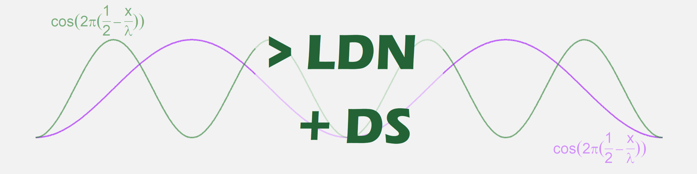

 

 

Hello! I'm Leonardo, biologist and math student. Passionate self-taught R developer from Brazil.

 

 

 

<a href="https://github.com/anuraghazra/github-readme-stats">
  <!-- Change the `github-readme-stats.anuraghazra1.vercel.app` to `github-readme-stats.vercel.app`  -->
  
</a>

<!--
**LeonardoDonatoNunes/LeonardoDonatoNunes** is a ✨ _special_ ✨ repository because its `README.md` (this file) appears on your GitHub profile.

